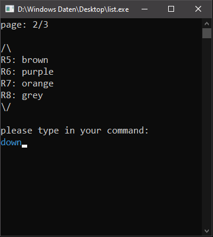
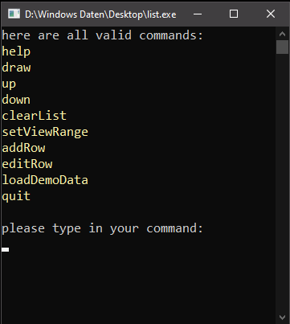

# adjustable-cpp-list

This small console application I wrote demonstrates the useage of a std::list in c++.

## features
 - navigable list
 - adjustable row-display size
 - current- and maximum page number display, which adjusts according to row-display size and list size
 - invalid command input notification 
 - colorized text in order to improve the overview
 - editable rows
 
## command summery
|  |  |
|--|--|
| ***help*** ‎ ‎ ‎ ‎ ‎ ‎ ‎ ‎ ‎ ‎ ‎ ‎ ‎ ‎ ‎ ‎ ‎ ‎ ‎ ‎ ‎ ‎ ‎ ‎ ‎ ‎  | show all available commands |
| ***draw***| print the list |
| ***up***| navigate one page up (scrolling up) |
| ***down***| navigate one page down(scrolling down) |
| ***clearList***| delete all content of the entire list  |
| ***setViewRange***| set how many lines of the list you want to display |
| ***addRow***| add a row to the bottom |
| ***editRow***| edit a specific row |
| ***loadDemoData***| load a demo list with 11 different rows (colors)|
| ***quit***| exit the programm / close console |

## example pictures

| main view | navigate down|
|--|--|
|  |  |

| invalid command | set view range to 8 |
|--|--|
|  |  |

| clear list | add row |
|--|--|
|  |  |

| help |
|--|
|  |  

